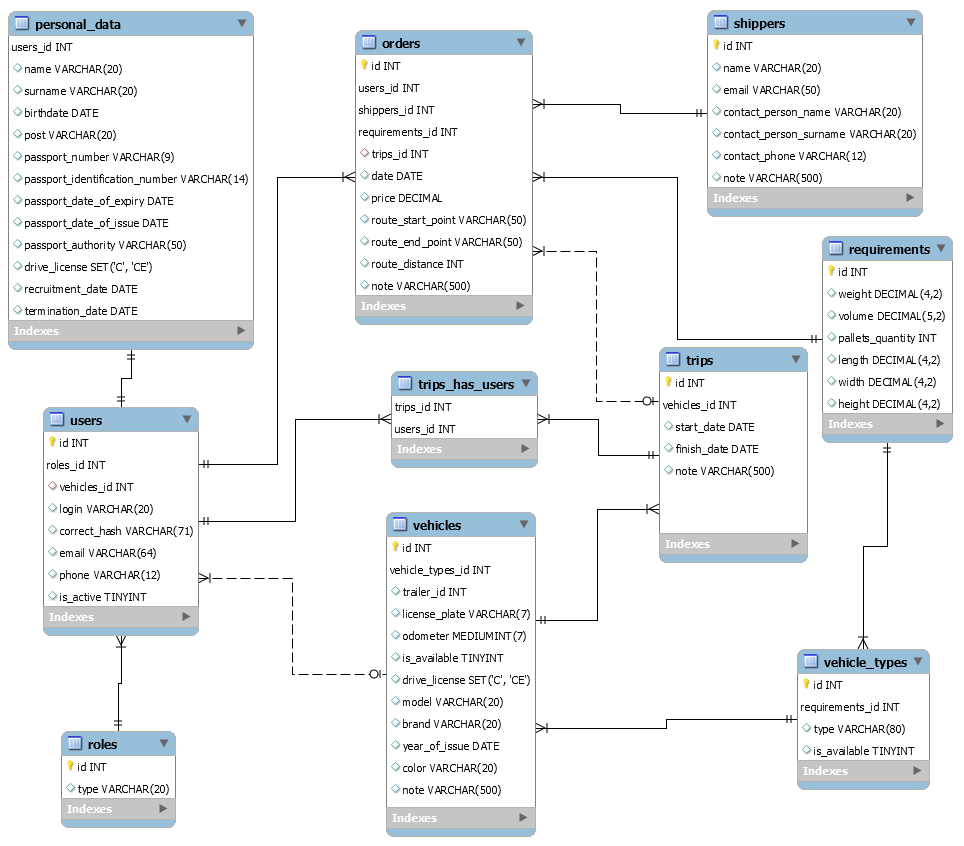

# JWD_Final_Project

Theme of development, WEB-project "Transport system".

The Order consists of the Shipper and the cargo transportation Requirement (total tonnage, volume, pallets).
Trips are formed by Logist from Orders taking into account the capacity and condition of the Vehicle.
Drivers receive Trips. Every driver has a Vehicle.
Vehicles have different types. Also drive in a trailer-driven road train.
After the Trip, the driver writes notes on the condition of the Vehicle.

Logist:
- adds/ deletes/ views Orders.
- adds/ views Requirements
- adds/ views Shippers
- adds/ deletes/ views Trips
- changes drivers vehicle to other vehicle/ browses the driver list

Mechanic:
- adds/ edits/ views Vehicles
- adds/ views Requirement

Driver:
- receives/ starts/ ends Trip

Admin:
- Views/ edits user's personal data

Database tables

